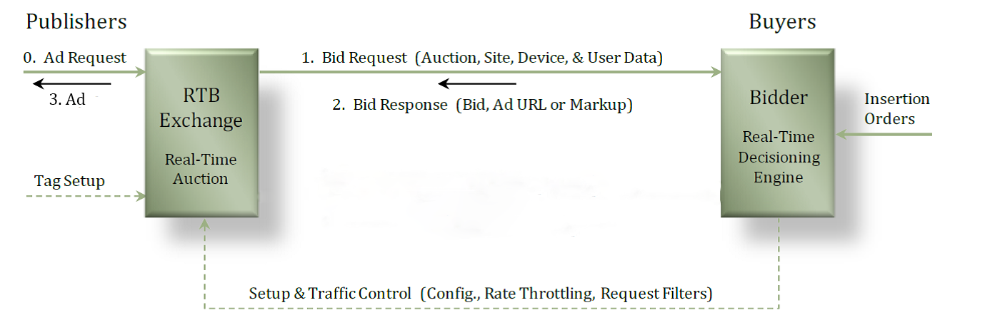

ExelBid RTB Integration Guide
=======================

  * [1. Introduction](#1-introduction)
    * [1.1 What is ExelBid RTB?](#11-what-is-exelbid-rtb)
    * [1.2 Integration Process](#12-integration-process)
    * [1.3 ExelBid History](#13-exelbid-history)
  * [2. OpenRTB Basics](#2-openrtb-basics)
    * [2.1 Transport](#21-transport)
    * [2.2 Data Format](#22-data-format)
    * [2.3 OpenRTB Version HTTP Header](#23-openrtb-version-http-header)
    * [2.4 ExelBid Integration Details](#24-exelbid-integration-details)
      * [2.4.1 Supported Creative Types](#241-supported-creative-types)
  * [3. Bid Request Specification](#3-bid-request-specification)
    * [3.1 Object Model](#31-object-model)
    * [3.2 Object Specifications](#32-object-specifications)
      * [3.2.1 Object: BidRequest](#321-object-bidrequest)
      * [3.2.2 Object: Imp](#322-object-imp)
        * [3.2.2.1 Object: Ext](#3221-object-ext)
      * [3.2.3 Object: Banner](#323-object-banner)
      * [3.2.4 Object: Native](#324-object-native)
      * [3.2.5 Object: Site](#325-object-site)
      * [3.2.6 Object: App](#326-object-app)
      * [3.2.7 Object: Publisher](#327-object-publisher)
      * [3.2.8 Object: Device](#328-object-device)
      * [3.2.9 Object: Geo](#329-object-geo)
      * [3.2.10 Object: User](#3210-object-user)
      * [3.2.11 Object: Data](#3211-object-data)
      * [3.2.12 Object: Segment](#3212-object-segment)
      * [3.2.13 Object: Pmp](#3213-object-pmp)
      * [3.2.14 Object: Deal](#3214-object-deal)
  * [4. Bid Response Specification](#4-bid-response-specification)
    * [4.1 Object Model](#41-object-model)
    * [4.2 Object Specifications](#42-object-specifications)
      * [4.2.1 Object: BidResponse](#421-object-bidresponse)
      * [4.2.2 Object: SeatBid](#422-object-seatbid)
      * [4.2.3 Object: Bid](#423-object-bid)
      * [4.2.4 Object: Ext](#424-object-ext)
      * [4.2.5 Opt-out 설정](#425-opt-out-설정)
    * [4.3 Substitution Macros](#43-substitution-macros)
  * [5. Native Specification](#5-native-specification)
    * [5.1 Native markup Request Object](#51-native-markup-request-object)
    * [5.2 Native markup Response Object](#52-native-markup-response-object)
  * [6. Enumerated Lists Specification](#6-enumerated-lists-specification)
  * [7. Bid Request/Response Samples](#7-bid-requestresponse-samples)
    * [7.1 Bid Requests](#71-bid-requests)
      * [7.1.1 Example 1 (Image Banner Creative)](#711-example-1-(image-banner-creative))
      * [7.1.2 Example 2 (Native Creative)](#712-example-2-(native-creative))
    * [7.2 Bid Responses](#72-bid-responses)
      * [7.2.1 Example 1 (Image Banner Creative Response)](#721-example-1-(image-banner-creative-response))
      * [7.2.3 Example 2 (Native Markup Returned Inline)](#722-example-2-(native-markup-returned-inline))
  * [8. Extension Explanation](#8-extension-explanation)
    * [8.1 Click tracking for publisher](#81-click-tracking-for-publisher)
      * [8.1.1 Unescaped request sample](#811-unescaped-request-sample)
      * [8.1.2 Unescaped response sample](#812-unescaped-response-sample)
      * [8.1.3 Escaped request sample](#813-escaped-request-sample)
      * [8.1.4 Escaped response sample](#814-escaped-response-sample)

### 1. Introduction

#### 1.1 What is ExelBid RTB?

ExelBid(Excellent Bid) is an OpenRTB protocol–based advertisement auction system operating between Demand-Side Providers (DSP) and Supply-Side Providers (SSP). ExelBid currently supports OpenRTB 2.3 and OpenRTB Native-Ads-Specification 1.0. However, we do not fully support the Object from the spec but is limited to our definition in this document.

#### 1.2 Integration Process

#### 1.3 ExelBid History
- 2017-06-23 - Add optouturl to Bid Response bid-ext, and implement 4.2.5 Opt-out setting guide (※Korea Communication Commission – Customized online ad privacy protection guide)

### 2. OpenRTB Basics

The diagram below shows interaction between exchange and bidder. Bid requests are created from the publisher’s mobile, and all requests will be available for all bidders. Once bidders return bid responses, auction algorithm will determine the winner of the bids and notify the winning bidder.



#### 2.1 Transport

HTTP is a protocol for data transfer. Bid requests will be sent via POST requests, and winner notification will be delivered by GET response. All requests should be returned with HTTP 200, with a single exception of No Bid, which will be returned with 204 code.

#### 2.2 Data Format

JSON is a data format for bid requests and responses. Bid Request’s header must have *Content-Type : application/json*, and the same format must be used for bid responses

```
Content-Type: application/json
```

#### 2.3 OpenRTB Version HTTP Header

Include OpenRTB version to request header. ExelBid is on OpenRTB 2.3

```
x-openrtb-version: 2.3
```

#### 2.4 ExelBid Integration Details

##### 2.4.1 Supported Creative Types

  - Banner: Image Banner creative, 320 x 50
  - Interstitial: Full-screen image creative, 320 x 480 or 640 x 960
  - Native: Banner creative that integrates to mobile application’s UI. Please refer to OpenRTB’s Native Spec

### 3. Bid Request Specification

RTB transactions are initiated when an exchange or other supply source sends a bid request to a bidder. The bid request consists of the top-level bid request object, at least one impression object, and may optionally include additional objects providing impression context

#### 3.1 Object Model

#### 3.2 Object Specifications

##### 3.2.1 Object: BidRequest

The top-level bid request object contains a globally unique bid request, auction ID, imp, app, or site. It is optional recommended to include attributes such as device, cur, and test.

 Name   | Type         | Required, Default  | Description                                                               
:-------|:-------------|:--------------|:--------------------------------------------------------------------------
 id     | string       | Required          | Unique ID of the bid request                                               
 imp    | object array | Required          | Array of Imp objects                                             
 site   | object       | Required(or app)  | Either one of app or site must is required                
 app    | object       | Required(or site) | Either one of app or site must is required                
 device | object       | Recommended              | Details via a Device object about the user’s device to which the impression will be delivered.                     
 user   | object       | Recommended              | Details via a User object about the human user of the device; the advertising audience.                                            
 test   | integer      | Default 0      | Indicator of test mode in which auctions are not billable, where 0 = live mode, 1 = test mode.                            
 at     | integer      | Default 2      | Auction type, where 1 = First Price, 2 = Second Price Plus. Exchange-specific auction types can be defined using values greater than 500.
 tmax   | integer      |               | Maximum time in milliseconds to submit a bid to avoid timeout. This value is commonly communicated offline.                    
 cur    | string array | Default "USD"  | Array of allowed currencies for bids on this bid request using ISO-4217 alpha codes. Recommended only if the exchange accepts multiple currencies.                                      
 bcat   | string array |               | Blocked advertiser categories using the IAB content categories. Refer to List 5.1 from OpenRTB.
 badv   | string array |               | Block list of advertisers by their domains (e.g., “ford.com”).                      

##### 3.2.2 Object: Imp

This object describes an ad placement or impression being auctioned.

 Name              | Type    | Required, Default    | Description                                                  
:------------------|:--------|:----------------|:-------------------------------------------------------------
 id                | string  | Required            | A unique identifier for this impression within the context of the bid request.
 banner            | object  | Required(or native) | Either one of banner or native must is required.
 native            | object  | Required(or banner) | Either one of banner or native must is required.
 pmp               | object  |                 | Pmp object includes this imp’s object’s PMP agreement.
 displaymanager    | string  |                 | Name of ad mediation partner, SDK technology, or player responsible for rendering ad.                                               
 displaymanagerver | string  |                 | Version of ad mediation partner, SDK technology, or player responsible for rendering ad.                                              
 instl             | integer | Default 0        | 1 = the ad is interstitial or full screen, 0 = not interstitial.                               
 tagid             | string  |                 | Identifier for specific ad placement or ad tag that was used to initiate the auction.           
 bidfloor          | integer | Default 0        | Minimum bid for this impression expressed in CPM.                                   
 bidfloorcur       | string  | Default "USD"    | Currency specified using ISO-4217 alpha codes.   
 ext               | object  |                 | Include click_through_url. - Section 3.2.2.1 Object: Ext

##### 3.2.2.1 Object: Ext

  [ Refer to 8.Extension](#8-extension-extension)

  Name              | Type    | Required, Default    | Description                                                  
 :------------------|:--------|:----------------|:-------------------------------------------------------------
  click_through_url | string  |                 | Click URL. ${CLICK_URL_ESC} or {CLICK_URL_UNESC}

##### 3.2.3 Object: Banner

If not native or video ad, Banner object must be included.

 Name     | Type          | Required, Default | Description                                                                          
:---------|:--------------|:-------------|:-------------------------------------------------------------------------------------
 id       | string        |              | Unique identifier for this banner object. Recommended when Banner objects are used with a Video object (Section 3.2.4) to represent an array of companion ads. This attribute is not in use at the current version of ExelBid.
 w        | integer       | Required         | Width of the impression in pixels.                                                             
 h        | integer       | Required         | Height of the impression in pixels.                                                             
 btype    | integer array |              | Blocked banner ad types. Refer to OpenRTB Spec 2.3 List 5.2                    
 battr    | integer array |              | Blocked banner ad types. Refer to OpenRTB Spec 2.3 List 5.3                    
 pos      | integer       | Default 0     | Ad position on screen. Refer to OpenRTB Spec 2.3 List 5.4                               
 topframe | integer       | Default 0     | Indicates if the banner is in the top frame as opposed to an iframe, where 0 = no, 1 = yes.                

##### 3.2.4 Object: Native

This object represents a native type impression. Native ad units are intended to blend seamlessly into the surrounding content (e.g., a sponsored Twitter or Facebook post). As such, the response must be well-structured to afford the publisher fine-grained control over rendering.

 Name    | Type          | Required, Default | Description                                                                                        
:--------|:--------------|:-------------|:---------------------------------------------------------------------------------------------------
 request | string        | Required         | Request payload complying with the Native Ad Specification.
 ver     | string        |              | Version of the Native Ad Specification to which request complies.                                                                         
 battr   | integer array |              | Blocked creative attributes. Refer to OpenRTB 2.3 List 5.3.                              

##### 3.2.5 Object: Site

This object should be included if the ad supported content is a website as opposed to a non-browser application. A bid request must not contain both a Site and an App object.

 Name       | Type         | Required, Default | Description                                                    
:-----------|:-------------|:-------------|:---------------------------------------------------------------
 id         | string       | Required         | Site ID integrated to ExelBid,                              
 name       | string       | Required         | Site name.                                               
 domain     | string       | Required         | Domain of the site.
 cat        | string array |              | Array of IAB content categories of the site. Refer to OpenRTB List 5.1.                                 
 sectioncat | string array |              | Array of IAB content categories that describe the current page or view of the site. Refer to OpenRTB List 5.1.                             
 mobile     | integer      |              | Mobile-optimized signal, where 0 = no, 1 = yes.                          
 publisher  | object       |              | Details about the Publisher (Section 3.2.8) of the site.                                        

##### 3.2.6 Object: App

This object should be included if the ad supported content is a non-browser application (typically in mobile) as opposed to a website. A bid request must not contain both an App and a Site object.

 Name       | Type         | Required, Default | Description                                               
:-----------|:-------------|:-------------|:----------------------------------------------------------
 id         | string       | Required         | Exchange-specific app ID.                                  
 name       | string       | Required         | App name.                                          
 bundle     | string       | Required         | Application bundle or package name.
 domain     | string       |              | Domain of the app.                                      
 storeurl   | string       |              | App store URL for an installed app.
 cat        | string array |              | Array of IAB content categories of the site. Refer to OpenRTB List 5.1.                                  
 sectioncat | string array |              |Array of IAB content categories that describe the current page or view of the site. Refer to OpenRTB List 5.1.                           
 ver        | integer      |              | Application version.                                         
 paid       | integer      |              | 0 = app is free, 1 = the app is a paid version.                                        
 publisher  | object       | Required         | Details about the Publisher (Section 3.2.8) of the app.                                       

##### 3.2.7 Object: Publisher

 Name   | Type         | Required, Default | Description                     
:-------|:-------------|:-------------|:--------------------------------
 id     | string       | Required         | Publisher ID integrated to ExelBid.
 name   | string       | Required         | Publisher name.                
 cat    | string array |              | Array of IAB content categories that describe the publisher. Refer to OpenRTB 2.3 List 5.1.
 domain | string       |              | Highest level domain of the publisher.             

##### 3.2.8 Object: Device

This object describes the publisher of the media in which the ad will be displayed.

 Name           | Type    | Required, Default | Description                                                     
:---------------|:--------|:-------------|:----------------------------------------------------------------
 ua             | string  |              | Browser user agent string.                                                     
 geo            | object  | Required         | Location of the device assumed to be the user’s current location.                                               
 dnt            | integer |              | Standard “Do Not Track” flag as set in the header by the browser, where 0 = tracking is unrestricted, 1 = do not track.
 ip             | string  |              | IPv4 address closest to device.                                                     
 devicetype     | integer | Required         | The general type of device. Refer to OpenRTB 2.3 List 5.17.           
 make           | string  |              | Device make                                              
 model          | string  |              | Device model.                                             
 os             | string  | Required         | Device operating system.                               
 osv            | string  |              | Device operating system version.                                      
 h              | integer |              | Physical height of the screen in pixels.                                          
 w              | integer |              | Physical width of the screen in pixels.                                          
 language       | string  |              | Browser language using ISO-639-1-alpha-2                           
 carrier        | string  |              | Carrier or ISP.
 connectiontype | string  |              | Network connection type. Refer to OpenRTB 2.3 List 5.18.        
 ifa            | string  | Required         | ID sanctioned for advertiser use in the clear.                  

##### 3.2.9 Object: Geo

This object encapsulates various methods for specifying a geographic location. When subordinate to a
Device object, it indicates the location of the device which can also be interpreted as the user’s current
location. When subordinate to a User object, it indicates the location of the user’s home base (i.e., not
necessarily their current location).

 Name    | Type    | Required, Default | Description                                      
:--------|:--------|:-------------|:-------------------------------------------------
 lat     | float   |              | Latitude from -90.0 to +90.0, where negative is south.                                             
 lon     | float   |              | Longitude from -180.0 to +180.0, where negative is west.                                             
 type    | integer |              | Source of location data. Refer to OpenRTB 2.3 List 5.16.
 country | string  |              | Country code using ISO-3166-1-alpha-3.               

##### 3.2.10 Object: User

This object contains information known or derived about the human user of the device.

 Name     | Type    | Required, Default | Description                                                                        
:---------|:--------|:-------------|:-----------------------------------------------------------------------------------
 id       | string  |              | Exchange-specific ID for the user.                                  
 yob      | integer |              | Year of birth as a 4-digit integer                                                               
 gender   | string  |              | Gender, where “M” = male, “F” = female, “O” = known to be other.                                        
 keywords | string  |              | Comma separated list of keywords, interests, or intent.
 geo      | object  |              | Location of the user’s home base defined by a Geo object.                                                                       

##### 3.2.11 Object: Data

The data and segment objects together allow additional data about the user to be specified.

 Name    | Type         | Required, Default | Description                                 
:--------|:-------------|:-------------|:--------------------------------------------
 id      | string       |              | Exchange-specific ID for the data provider.
 name    | string       |              | Exchange-specific name for the data provider.                         
 segment | object array |              | Array of Segment objects that contain the actual data values.  

##### 3.2.12 Object: Segment

Segment objects are essentially key-value pairs that convey specific units of data about the user

 Name  | Type   | Required, Default | Description                       
:------|:-------|:-------------|:----------------------------------
 id    | string |              | Unique ID of the segment.
 name  | string |              | Name of the data segment.                      
 value | string |              | String representation of the data segment value.                           

##### 3.2.13 Object: Pmp

Included in Imp object, and includes information necessary to use RTB protocol in Private MarketPlace or direct deal.

   Name              | Type   | Required, Default | Description                       
  :------------------|:-------|:------------|:----------------------------------
   private_auction   | string | Default 0     | unique ID to identify data
 deals             | object |             | deal object array that contains direct deals list for this imp


##### 3.2.14 Object: Deal

This is approved agreement between the buyer and seller, and its presence
with the PMP indicates that this impression is available under the terms of that agreement.

   Name              | Type    | required, default   | Description                                                  
  :------------------|:--------|:----------------|:-------------------------------------------------------------
  id                | string  | required            | A unique indenfier that used within BidRequest object to identify imp.
  bidfloor          | integer | Default 0        | Impression’s bid floor                                     
  bidfloorcur       | string  | Default "USD"    |Currency specified using ISO–4217 alphabet codes.
  wseat             | string array |            | whitelist of buyer seats
  wadomain          | string array |            |List of advertiser’s domain that is allowed to bid in this deal
  at                | integer |                 | Optional override of the overall auction type of the bid request. Additional auction types can be defined by the exchange.                      

### 4. Bid Response Specification

#### 4.1 Object Model

At least one seatbid object is required, which contains at least one bid for an impression.

 Name        | Type   | Required, Default | Description                                                                                                                                           
:------------|:-------|:-------------|:------------------------------------------------------------------------------------------------------------------------------------------------------
 BidResponse | object | Required         | Top-level object.                                                                                                                                                
 seatbid     | object | Required         | Collection of bids made by the bidder on behalf of a specific seat.                                                                                           
 bid         | object | Required         | An offer to buy a specific impression under certain business terms.                                                                                                
 ext         | object |              | Extension of the OpenRTB specification. Exelbid uses ext field for Native creative response using JSON.

#### 4.2 Object Specifications

##### 4.2.1 Object: BidResponse

 Name    | Type         | Required, Default | Description                                                                              
:--------|:-------------|:-------------|:-----------------------------------------------------------------------------------------
 id      | string       | Required         | Bid Request의 ID                                                                         
 seatbid | object array | Required         |                                                                                          
 bidid   | string       |              | Bidder generated response ID to assist with logging/tracking.              
 cur     | string       | Required     | Bid currency using ISO-4217 alpha codes                                                               
 nbr     | integer      |              | Reasons for not bidding. Refer to OpenRTB 2.3 List 5.19.                                                      
 ext     |              |              | Extension of the OpenRTB specification. Exelbid uses ext field for Native creative response using JSON.

Top-level object that uses ID congruent to BidRequest’s ID. At least one seatbid object is required for a single imp object.

##### 4.2.2 Object: SeatBid

 Name | Type         | Required, Default | Description                                                                                                                                   
:-----|:-------------|:-------------|:----------------------------------------------------------------------------------------------------------------------------------------------
 bid  | object array | Required         | Response object to imp object.                                                                                                                       
 seat | string       |              | ID of the bidder seat on whose behalf this bid is made.                                                                                                                    
 ext  |              |              | Extension of the OpenRTB specification. Exelbid uses ext field for Native creative response using JSON.

##### 4.2.3 Object: Bid

 Name    | Type         | Required, Default | Description                                                                                                                                                                                  
:--------|:-------------|:-------------|:---------------------------------------------------------------------------------------------------------------------------------------------------------------------------------------------
 id      | string       | Required         | Bidder generated bid ID to assist with logging/tracking.
 impid   | string       | Required         | ID of the Imp object in the related bid request.                                                                                                                 
 price   | float        | Required         | Bid price expressed as CPM.                                                                                           
 adid    | string       |              | ID of a preloaded ad to be served if the bid wins.                                                                                                                               
 nurl    | string       |              | Win notice URL called by the exchange if the bid wins.
 adm     | string       |              | Optional means of conveying ad markup in case the bid wins.                                                                                                                                                                        
 adomain | string array | Required     | Advertiser domain for block list checking.                                                                                                                                 
 bundle  | string       |              | Package name in case of application.                                                                                                                                                   
 iurl    | string       | Required     | URL without cache-busting to an image that is representative of the content of the campaign for ad quality/safety checking.                                                                                           
 cid     | string       | Required     | Campaign ID to assist with ad quality checking; the collection of creatives for which iurl should be representative.                                                                                                                                                              
 crid    | string       | Required     | Creative ID to assist with ad quality checking.                                                                                                                                                  
 cat     | string array |              | IAB content categories of the creative. Refer to OpenRTB 2.3 List 5.1.                                                                                                                      
 attr    | string array |              | Set of attributes describing the creative. Refer to OpenRTB 2.3 List 5.3.                                                                                                                          
 w       | integer      |              | Width of the creative in pixels.                                                                                                                                                           
 h       | integer      |              | Height of the creative in pixels.                                                                                                                                                             
 ext     | object       |              | Extension of the OpenRTB specification. Exelbid uses ext field for Native creative response using JSON.

##### 4.2.4 Object: Ext

 Bid Object’s Ext. Native ad request includes bid response object and optouturl (ad information link URL)

   Name    | Type         | Required, Default  | Description                                                                                                                                                                                  
  :--------|:-------------|:-------------|:---------------------------------------------------------------------------------------------------------------------------------------------------------------------------------------------
   native      | object       |          | bid reponse object for native bid request                                                                                                         
   optouturl   | string       | recommend | set up opt-out url for customized targeting ad

##### 4.2.5 Opt-out Setting

   ※ According to Customized online ad privacy protection guide (Korea Communication Commission-2014), online customized ad business holder need to provide opt-out option for the shown ad  _**(only for targeting ads)**_ .
   - For image banners, icon and link must be set up at Response Bid -> adm
   - For natives, sdk will guide to show icon and link if there is optouturl at bid-ext


#### 4.3 Substitution Macros

The win notice URL and its format are defined by the bidder. In order for the exchange to convey certain information to the winning bidder (e.g., the clearing price), a number of substitution macros can be inserted into the win notice URL definition. ExelBid will search the specified URL for any of the defined macros and replace them with the appropriate data. If the source value is an optional parameter that was not specified, the macro will simply be removed (i.e., replaced with a zero-length string).

 Macro                   | Description                                               
:------------------------|:----------------------------------------------------------
 ${AUCTION_ID}           | BidRequest의 id                                           
 ${AUCTION_ID:B64}       | BidRequest id encoded in Base64.                   
 ${AUCTION_BID_ID}       | BidResponse의 id                                          
 ${AUCTION_BID_ID:B64}   | BidResponse id encoded in Base64.                      
 ${AUCTION_IMP_ID}       | ID of the impression just won.                  
 ${AUCTION_IMP_ID:B64}   | ID of the impression just won. Encoded in Base64.         
 ${AUCTION_SEAT_ID}      | ID of the bidder seat for whom the bid was made.                    
 ${AUCTION_SEAT_ID:B64}  | ID of the bidder seat for whom the bid was made. Encoded in Base64.
 ${AUCTION_AD_ID}        | ID of the ad markup the bidder wishes to serve.                   
 ${AUCTION_AD_ID:B64}    | ID of the ad markup the bidder wishes to serve. Encoded in Base64.
 ${AUCTION_PRICE}        | Settlement price using the same currency and units as the bid.                                              
 ${AUCTION_PRICE:B64}    | Settlement price using the same currency and units as the bid. Encoded in Base64.                            
 ${AUCTION_CURRENCY}     | The currency used in the bid (explicit or implied).                                    
 ${AUCTION_CURRENCY:B64} | The currency used in the bid (explicit or implied). Encoded in Base64.                   

To specify that a particular macro is to be encoded, the suffix “:X” should be appended to the macro name. Algorithms choices are not defined by this specification and must be mutually agreed upon between exchange and bidder. ExelBid supports Base64 Encoding.

### 5. Native Specification

ExelBid Native is based on OpenRTB Native Ads Specification 1.0. With few exceptions of video-related requests and responses, ExelBid complies with the standard.

#### 5.1 Native markup Request Object

Bid Request Specification. Refer to OpenRTB-Native-Ads-Specification 1.0 for more detais.

<table>
<tr>
  <th>Field</th>
  <th>Scope</th>
  <th>Field</th>
  <th>Scope</th>
  <th>Field</th>
  <th>Scope</th>
</tr>
<tr>
  <td>ver</td>
  <td>string; optional</td>
  <td></td>
  <td></td>
  <td></td>
  <td></td>
</tr>
<tr>
  <td>layout</td>
  <td>integer; recommended</td>
  <td></td>
  <td></td>
  <td></td>
  <td></td>
</tr>
<tr>
  <td>adunit</td>
  <td>integer; recommended</td>
  <td></td>
  <td></td>
  <td></td>
  <td></td>
</tr>
<tr>
  <td>plcmtcnt</td>
  <td>integer; optional</td>
  <td></td>
  <td></td>
  <td></td>
  <td></td>
</tr>
<tr>
  <td>seq</td>
  <td>integer; optional</td>
  <td></td>
  <td></td>
  <td></td>
  <td></td>
</tr>
<tr>
  <td rowspan="16">assets</td>
  <td rowspan="16">array of objects;
required</td>
  <td>id</td>
  <td>integer; required</td>
  <td></td>
  <td></td>
</tr>
<tr>
  <td>required</td>
  <td>integer; optional</td>
  <td></td>
  <td></td>
</tr>
<tr>
  <td>title</td>
  <td>object; optional</td>
  <td>len</td>
  <td>integer; required</td>
</tr>
<tr>
  <td>ext</td>
  <td>object; optional</td>
</tr>
<tr>
  <td rowspan="7">img</td>
  <td rowspan="7">object; optional</td>
  <td>type</td>
  <td>integer; optional</td>
</tr>
<tr>
  <td>w</td>
  <td>integer; optional</td>
</tr>
<tr>
  <td>wmin</td>
  <td>integer; recommended</td>
</tr>
<tr>
  <td>h</td>
  <td>integer; optional</td>
</tr>
<tr>
  <td>hmin</td>
  <td>integer; recommended</td>
</tr>
<tr>
  <td>mimes</td>
  <td>array of strings; required</td>
</tr>
<tr>
  <td>ext</td>
  <td>object; optional</td>
</tr>
<tr>
  <td><strike>video</strike></td>
  <td><strike>object; optional</strike></td>
  <td></td>
  <td></td>
</tr>
<tr>
  <td rowspan="3">data</td>
  <td rowspan="3">object; optional</td>
  <td>type</td>
  <td>integer; required</td>
</tr>
<tr>
  <td>len</td>
  <td>integer; optional</td>
</tr>
<tr>
  <td>ext</td>
  <td>object; optional</td>
</tr>
<tr>
  <td>ext</td>
  <td>object; optional</td>
  <td></td>
  <td></td>
</tr>
<tr>
  <td>ext</td>
  <td>object; optional</td>
  <td></td>
  <td></td>
  <td></td>
  <td></td>
</tr>
</table>

#### 5.2 Native markup Response Object

Please refer to OpenRTB 2.3 Native Ads Specification for details<br>
At ExelBid, we provide 2 bidding options. 1. Basically we insert serialized string in adm field or 2. Native object goes under ext object - bid -> ext -> native (refer to 7.2.3 Example 2 - Native Ad Response)

<table>
<tr>
  <th>Field</th>
  <th>Scope</th>
  <th>Field</th>
  <th>Scope</th>
  <th>Field</th>
  <th>Scope</th>
  <th>Field</th>
  <th>Scope</th>
</tr>
<tr>
  <td rowspan="25">native</td>
  <td rowspan="25">object;
required</td>
  <td>ver</td>
  <td>integer; optional</td>
  <td></td>
  <td></td>
  <td></td>
  <td></td>
</tr>
<tr>
  <td rowspan="17">assets</td>
  <td rowspan="17">array of objects;
required</td>
  <td>id</td>
  <td>integer; required</td>
  <td></td>
  <td></td>
</tr>
<tr>
  <td>required</td>
  <td>integer; optional</td>
  <td></td>
  <td></td>
</tr>
<tr>
  <td rowspan="2">title</td>
  <td rowspan="2">object; optional</td>
  <td>text</td>
  <td>string; required</td>
</tr>
<tr>
  <td>ext</td>
  <td>object; optional</td>
</tr>
<tr>
  <td rowspan="4">img</td>
  <td rowspan="4">object; optional</td>
  <td>url</td>
  <td>string; required</td>
</tr>
<tr>
  <td>w</td>
  <td>integer; recommended</td>
</tr>
<tr>
  <td>h</td>
  <td>integer; recommended</td>
</tr>
<tr>
  <td>ext</td>
  <td>object; optional</td>
</tr>
<tr>
  <td><strike>video</strike></td>
  <td><strike>object; optional</strike></td>
  <td></td>
  <td></td>
</tr>
<tr>
  <td rowspan="3">data</td>
  <td rowspan="3">object; optional</td>
  <td>label</td>
  <td>string; optional</td>
</tr>
<tr>
  <td>value</td>
  <td>string; required</td>
</tr>
<tr>
  <td>ext</td>
  <td>object; optional</td>
</tr>
<tr>
  <td rowspan="4">link</td>
  <td rowspan="4">object; optional</td>
  <td>url</td>
  <td>string; required</td>
</tr>
<tr>
  <td>clicktrackers[]</td>
  <td>array of strings; required</td>
</tr>
<tr>
  <td><strike>fallback</strike></td>
  <td><strike>string; optional</strike></td>
</tr>
<tr>
  <td>ext</td>
  <td>object; optional</td>
</tr>
<tr>
  <td>ext</td>
  <td>object; optional</td>
  <td></td>
  <td></td>
</tr>
<tr>
  <td rowspan="4">link</td>
  <td rowspan="4">object; required</td>
  <td>url</td>
  <td>string; required</td>
  <td></td>
  <td></td>
</tr>
<tr>
  <td>clicktrackers[]</td>
  <td>array of strings; required</td>
  <td></td>
  <td></td>
</tr>
<tr>
  <td><strike>fallback</strike></td>
  <td><strike>string; optional</strike></td>
  <td></td>
  <td></td>
</tr>
<tr>
  <td>ext</td>
  <td>object; optional</td>
  <td></td>
  <td></td>
</tr>
<tr>
  <td>imptrackers[]</td>
  <td>array of strings;optional</td>
  <td></td>
  <td></td>
  <td></td>
  <td></td>
</tr>
<tr>
  <td><strike>jstracker</strike></td>
  <td><strike>string; optional</strike></td>
  <td></td>
  <td></td>
  <td></td>
  <td></td>
</tr>
<tr>
  <td>ext</td>
  <td>object; optional</td>
  <td></td>
  <td></td>
  <td></td>
  <td></td>
</tr>
</table>

### 6. Enumerated Lists Specification

*Please refer to the OpenRTB 2.3 Specification*

### 7. Bid Request/Response Samples

#### 7.1 Bid Requests

##### 7.1.1 Example 1 (Image Banner Creative)

```json
{
  "id": "57a06a911b3f68cd5cacdc46",
  "imp": [
    {
      "id": "1",
      "banner": {
        "w": 320,
        "h": 50,
        "btype": [
          4
        ],
        "battr": [
          1,
          2,
          3,
          4,
          5,
          6,
          7,
          8,
          9,
          10,
          13,
          14,
          15,
          16
        ],
        "pos": 5
      },
      "displaymanager": "xxx",
      "displaymanagerver": "0.0.1",
      "instl": 0,
      "tagid": "c034046cce8edsff5f458b45dbc9ee4925a3f69a4",
      "bidfloor": 0.1,
      "bidfloorcur": "USD",
      "secure": 0
    }
  ],
  "app": {
    "id": "31",
    "name": "demoapp",
    "bundle": "com.demo.sample",
    "cat": [
      "IAB20"
    ],
    "ver": "4.3.0",
    "publisher": {
      "id": "14",
      "name": "xxx",
      "cat": [
        "IAB3"
      ],
      "domain": "www.xxx.com"
    }
  },
  "device": {
    "ua": "Mozilla/5.0 (Windows NT 6.2; WOW64) AppleWebKit/537.36 (KHTML, like Gecko) Chrome/51.0.2704.103 Safari/537.36",
    "geo": {
      "lat": 37.51350021362305,
      "lon": 127.02410125732422,
      "country": "KOR"
    },
    "dnt": 0,
    "lmt": 0,
    "ip": "192.168.171.1",
    "devicetype": 1,
    "make": "samsung,SM",
    "model": "samsung,SM",
    "os": "android",
    "osv": "4.3.0",
    "h": 2560,
    "w": 1440,
    "language": "ko-KR,ko;q=0.8,en-US;q=0.6,en;q=0.4",
    "carrier": "450-5",
    "connectiontype": 3
  },
  "user": {},
  "at": 2,
  "tmax": 200,
  "cur": [
    "USD"
  ],
  "bcat": [
    "IAB12"
  ]
}
```

##### 7.1.2 Example 2 (Native Creative)

```json
{
  "app": {
    "bundle": "com.xxx",
    "cat": [
      "IAB3"
    ],
    "id": "dc852dbcdf944f9f8c80ab3f281fd967",
    "name": "Truecaller - Caller ID & Block",
    "publisher": {
      "id": "34",
      "name": "xxx publisher"
    },
    "ver": "6.41"
  },
  "at": 2,
  "badv": [
    "badoo.com",
    "bigfish.com",
    "callapp.com",
    "holaa.me",
    "ktcs.co.kr",
    "m.pkr.com",
    "mrnumber.com",
    "nap4319.casino.bigfish.com",
    "pkr.com",
    "pkrtech.com",
    "whitepages.com",
    "whoscall.com"
  ],
  "bcat": [
    "IAB14-1",
    "IAB24",
    "IAB25",
    "IAB26",
    "IAB6-7",
    "IAB7-39",
    "IAB8-18",
    "IAB8-5",
    "IAB9-9"
  ],
  "device": {
    "carrier": "405-799",
    "connectiontype": 2,
    "dnt": 1,
    "geo": {
      "country": "KOR",
      "lat": 37.495499,
      "lon": 127.0162
    },
    "h": 1280,
    "ifa": "df58a938-d087-491d-985f-1c42ca3ef0da",
    "ip": "182.58.217.166",
    "js": 1,
    "language": "en",
    "lmt": 1,
    "make": "samsung",
    "model": "SM-E700H",
    "os": "Android",
    "osv": "5.1.1",
    "ua": "Mozilla\/5.0 (Linux; Android 5.1.1; SM-E700H Build\/LMY47X; wv) AppleWebKit\/537.36 (KHTML, like Gecko) Version\/4.0 Chrome\/47.0.2526.100 Mobile Safari\/537.36",
    "w": 720
  },
  "id": "64fcf249-da49-4e58-a5f0-9ffed99529d6",
  "imp": [
    {
      "bidfloor": 0.014,
      "displaymanager": "test",
      "displaymanagerver": "4.2.0",
      "id": "1",
      "instl": 0,
      "native": {
        "battr": [
          3,
          8,
          9,
          10,
          14,
          6
        ],
        "request": "{\"native\":{\"assets\":[{\"id\":1,\"required\":1,\"title\":{\"len\":25}},{\"id\":2,\"img\":{\"hmin\":80,\"type\":1,\"wmin\":80},\"required\":1},{\"id\":3,\"img\":{\"h\":80,\"type\":2,\"w\":80},\"required\":0},{\"id\":4,\"img\":{\"h\":627,\"type\":3,\"w\":1200},\"required\":1},{\"id\":5,\"data\":{\"len\":100,\"type\":1},\"required\":0},{\"id\":6,\"data\":{\"len\":100,\"type\":2},\"required\":1},{\"id\":7,\"data\":{\"len\":100,\"type\":3},\"required\":0},{\"id\":8,\"data\":{\"len\":100,\"type\":4},\"required\":0},{\"id\":9,\"data\":{\"len\":100,\"type\":5},\"required\":0},{\"id\":10,\"data\":{\"len\":100,\"type\":6},\"required\":0},{\"id\":11,\"data\":{\"len\":100,\"type\":7},\"required\":0},{\"id\":12,\"data\":{\"len\":100,\"type\":8},\"required\":0},{\"id\":13,\"data\":{\"len\":100,\"type\":9},\"required\":0},{\"id\":14,\"data\":{\"len\":100,\"type\":10},\"required\":0},{\"id\":15,\"data\":{\"len\":100,\"type\":11},\"required\":0},{\"id\":16,\"data\":{\"len\":15,\"type\":12},\"required\":0}],\"layout\":6}}",
        "ver": "1.0.0.2"
      },
      "tagid": "072df02f86984dc6b50d74b0ad42bb85"
    }
  ]
}
```

#### 7.2 Bid Responses

##### 7.2.1 Example 1 (Image Banner Creative Response)

```json
{
  "id": "57a06a911b3f68cd5cacdc46",
  "seatbid": [
    {
      "bid": [
        {
          "id": "57c52635e0012acf8c2a86e9",
          "impid": "1",
          "price": 1,
          "nurl":"http://xxx.com/exelbid/nurl?id=57c52635e0012acf8c2a86e9&price=${AUCTION_PRICE}",
          "adm": "<a href=\"http://xxx.com/exelbid/click?id=57c52635e0012acf8c2a86e9\" target=\"_top\"></a>",
          "adomain": [
            "onnuridmc.com"
          ],
          "iurl": "http://xxx.com/banner/201603/7dbe91ea14481e617850633c04a6883d.jpg",
          "cid": "177",
          "crid": "470",
          "cat": [
            "IAB1"
          ],
          "h": 50,
          "w": 320
        }
      ],
      "seat": "xxx",
      "group": 0
    }
  ],
  "cur": "USD"
}
```

##### 7.2.2 Example 2 (Native Markup Returned Inline)

```json
{
  "id": "61dcf249-da49-4e58-a5f0-9ffed99529d6",
  "seatbid": [
    {
      "bid": [
        {
          "id": "57c5468e0c5fb71f81bf6967",
          "impid": "1",
          "price": 0.10000000149011612,
          "nurl": "http://kr-09.cross-target.com/exelbid/nurl?id=57c5468e0c5fb71f81bf6967&cb_click_url=${CLICK_URL}&price=${AUCTION_PRICE}",
          "adomain": [
            "onnuridmc.com"
          ],
          "iurl": "http://xxx.com/banner/201606/23d4472b27bb3795a5c403b5374906e7.jpg",
          "cid": "178",
          "crid": "527",
          "cat": [
            "IAB1"
          ],
          "h": 0,
          "w": 0,
          "ext": {
            "native": {
              "ver": "1.0.0.2",
              "link": {
                "url": "http://xxx.com/exelbid/click?id=57c5468e0c5fb71f81bf6967"
              },
              "imptrackers": [
                "http://kr-09.cross-target.com/exelbid/imgtracker?id=57c5468e0c5fb71f81bf6967&cb_click_url=${CLICK_URL}&price=${AUCTION_PRICE}"
              ],
              "assets": [
                {
                  "id": 16,
                  "data": {
                    "value": "지금설치2"
                  },
                  "link": {
                    "url": "http://xxx.com/exelbid/click?id=57c5468e0c5fb71f81bf6967"
                  }
                },
                {
                  "id": 6,
                  "data": {
                    "value": "특급호텔부터 유명 리조트까지 오늘 남은 객실을 최대 80%할인된 가격으로"
                  }
                },
                {
                  "id": 2,
                  "img": {
                    "url": "http://xxx.com/banner/201606/f5c17b5a78a974229a29e761517ed120.png",
                    "w": 80,
                    "h": 80
                  }
                },
                {
                  "id": 4,
                  "img": {
                    "url": "http://xxx.com/banner/201606/23d4472b27bb3795a5c403b5374906e7.jpg",
                    "w": 1200,
                    "h": 627
                  }
                },
                {
                  "id": 1,
                  "title": {
                    "text": "국내 최저가 호텔타임"
                  }
                }
              ]
            }
          }
        }
      ],
      "seat": "xxx",
      "group": 0
    }
  ],
  "cur": "USD"
}
```

### 8 Extension Explanation
#### 8.1 Click tracking for publisher
  In Exelbid, publishers provide markup to Imp Object Extension (Imp.ext.click_through_url) to measure clicks. <br>
  DSP는 click_through_url 을 이용하여 클릭 URL을 새로 만들어야 한다.
  <table>
  <tr>
    <th>Macup</th>
    <th>Scope</th>
    <th>Description</th>
  </tr>
  <tr>
    <td>${CLICK_URL_ESC}</td>
    <td>string</td>
    <td>Escaped Click URL</td>
  </tr>
  <tr>
    <td>${CLICK_URL_UNESC}</td>
    <td>string</td>
    <td>Unescaped Click URL</td>
  </tr>
  </table>

##### 8.1.1 Unescaped request sample
```json
{
  "imp": [
    {
      "bidfloor": 0.014,
      "displaymanager": "test",
      "displaymanagerver": "4.2.0",
      "id": "1",
      "instl": 0,
      "tagid": "072df02f86984dc6b50d74b0ad42bb85",
      "ext":{
        "$click_through_url" : "${CLICK_URL_UNESC}"
      }
    }
  ]
}
```
##### 8.1.2 Unescaped response sample
Orignal click url : http://xxx.com/exelbid/click?id=57c52635e0012acf8c2a86e9
```json
{
  "id": "57a06a911b3f68cd5cacdc46",
  "seatbid": [
    {
      "bid": [
        {
          "id": "57c52635e0012acf8c2a86e9",
          "impid": "1",
          "price": 1,
          "nurl":"http://xxx.com/exelbid/nurl?id=57c52635e0012acf8c2a86e9&price=${AUCTION_PRICE}",
          "adm": "<a href=\"http://xxx.com/exelbid/click?id=57c52635e0012acf8c2a86e9\" target=\"_top\"></a>",
          "adomain": [
            "onnuridmc.com"
          ],
          "iurl": "http://xxx.com/banner/201603/7dbe91ea14481e617850633c04a6883d.jpg",
          "cid": "177",
          "crid": "470",
          "cat": [
            "IAB1"
          ],
          "h": 50,
          "w": 320
        }
      ],
      "seat": "xxx",
      "group": 0
    }
  ],
  "cur": "USD"
}
```

##### 8.1.3 Escaped request sample
```json
{
  "imp": [
    {
      "bidfloor": 0.014,
      "displaymanager": "test",
      "displaymanagerver": "4.2.0",
      "id": "1",
      "instl": 0,
      "tagid": "072df02f86984dc6b50d74b0ad42bb85",
      "ext":{
        "$click_through_url" : "http://xxx.exelbid.com/test?id=100&redirect=${CLICK_URL_ESC}"
      }
    }
  ]
}
```
##### 8.1.4 Escaped response sample
Orignal click url : http://xxx.com/exelbid/click?id=57c52635e0012acf8c2a86e9
```json
{
  "id": "57a06a911b3f68cd5cacdc46",
  "seatbid": [
    {
      "bid": [
        {
          "id": "57c52635e0012acf8c2a86e9",
          "impid": "1",
          "price": 1,
          "nurl":"http://xxx.com/exelbid/nurl?id=57c52635e0012acf8c2a86e9&price=${AUCTION_PRICE}",
          "adm": "<a href=\"http://xxx.exelbid.com/test?id=100&redirect=http%3A%2F%2Fxxx.com%2Fexelbid%2Fclick%3Fid%3D57c52635e0012acf8c2a86e9\" target=\"_top\"></a>",
          "adomain": [
            "onnuridmc.com"
          ],
          "iurl": "http://xxx.com/banner/201603/7dbe91ea14481e617850633c04a6883d.jpg",
          "cid": "177",
          "crid": "470",
          "cat": [
            "IAB1"
          ],
          "h": 50,
          "w": 320
        }
      ],
      "seat": "xxx",
      "group": 0
    }
  ],
  "cur": "USD"
}
```
