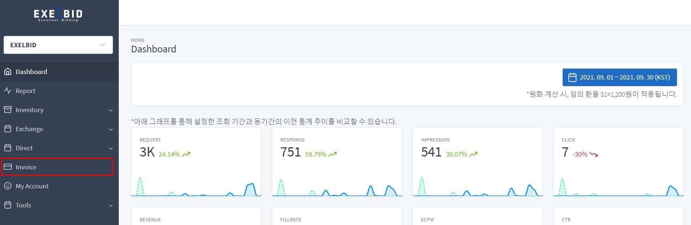
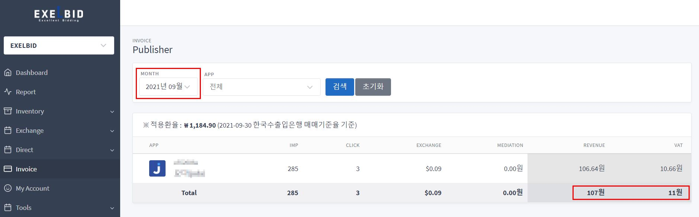

Publisher RTB 연동 가이드
=======================

  * [1. ExelBid 소개](#1-exelbid-소개)
    * [1.1 ExelBid RTB?](#11-exelbid-rtb)
    * [1.2 ExelBid 연동 절차](#12-exelbid-연동-절차)
    * [1.3 정산](#13-정산)
    * [1.4 변경 이력](#14-변경-이력)
  * [2. 전송 규약](#2-전송-규약)
  * [3. 입찰 요청(Bid Request Specification)](#3-입찰-요청bid-request-specification)
    * [3.1 Object: BidRequest](#31-object-bidrequest)
    * [3.2 Object: Imp](#32-object-imp)
      * [3.2.1 Object: Imp.ext](#321-object-impext)
    * [3.3 Object: Banner](#33-object-banner)
    * [3.4 Object: Video](#34-object-video)
    * [3.5 Object: Native](#35-object-native)
    * [3.6 Object: Site](#36-object-site)
    * [3.7 Object: App](#37-object-app)
    * [3.8 Object: Publisher](#38-object-publisher)
    * [3.9 Object: Content](#39-object-content)
    * [3.10 Object: Device](#310-object-device)
    * [3.11 Object: Geo](#311-object-geo)
    * [3.12 Object: User](#312-object-user)
    * [3.13 Object: Regs](#313-object-regs)
    * [3.14 Object: SupplyChain](#314-object-supplychain)
    * [3.15 Object: Pmp / Deal](#315-object-pmp--deal)
  * [4. 입찰 응답(Bid Response Specification)](#4-입찰-응답bid-response-specification)
    * [4.1 Object: BidResponse](#41-object-bidresponse)
    * [4.2 Object: SeatBid](#42-object-seatbid)
    * [4.3 Object: Bid](#43-object-bid)
    * [4.4 Object: Bid.ext](#44-object-bidext)
  * [5. 치환 매크로 (필독)](#5-치환-매크로-필독)
  * [6. Native 규격](#6-native-규격)
    * [6.1 개요](#61-개요)
    * [6.2 입찰 요청](#62-입찰-요청)
    * [6.3 입찰 응답](#63-입찰-응답)
  * [7. 참조 목록표(Enumerated Lists)](#7-참조-목록표enumerated-lists)
  * [8. 비딩 요청/응답 예제(Samples)](#8-비딩-요청응답-예제samples)
    * [8.1 Bid Requests](#81-bid-requests)
    * [8.2 Bid Responses](#82-bid-responses)


### 1. ExelBid 소개

#### 1.1 ExelBid RTB?

본 가이드는 매체(퍼블리셔/SSP)가 ExelBid에 OpenRTB 기반 입찰 요청을 보내고 응답을 수신하기 위한 연동 규격을 정의합니다. 본 연동에서 ExelBid는 **Buyer(구매자)** 역할을 수행합니다.

***OpenRTB Specification 2.3***을 기본으로 하며, 본 문서에 명시된 일부 상위 버전(2.4 / 2.5) 필드를 지원합니다. Native는 ***OpenRTB-Native-Ads-Specification 1.0***을 기본으로 하며 1.2 요청 필드도 수용합니다. 각 Object는 원문 스펙 전체가 아닌 본 규격에 정의된 범위에 한해 지원되며, 매체와 연동 시 상호 검토를 전제로 유연하게 적용될 수 있습니다.

#### 1.2 ExelBid 연동 절차

**연동 전 사전준비**
1) 엑셀비드 담당자가 SSP 파트너용 Questionnaire를 전달합니다.
2) SSP 파트너가 Questionnaire를 작성하여 회신하면 엑셀비드 담당자가 규격 검토 후, 연동 가능 여부를 안내합니다.
3) SSP 파트너는 엑셀비드 대시보드 사이트(manage.exelbid.com)에 가입 후, 가입 정보를 엑셀비드 담당자에게 전달합니다.
4) 엑셀비드 담당자가 해당 계정에 대해 대시보드 접근 권한을 부여합니다.
5) 엑셀비드에서 endpoint URL을 발급하면 SSP 파트너는 해당 URL의 정합성을 확인합니다.

**연동 테스트 및 실거래**
1) 본격적인 연동에 앞서 양사 간 연동 테스트를 진행합니다.
2) 테스트는 일반적으로 영업일 기준 약 5일에 걸쳐 진행되며, 상황에 따라 유동적으로 변동 가능합니다.
3) 테스트를 통해 양사 규격의 호환성, 필수값 포함 여부, 집계 수치 오차율 등을 확인합니다.
4) 연동 테스트 시, 최초의 광고요청에 대해서는 엑셀비드의 광고응답이 나가지 않습니다(no-bid). 이는 엑셀비드 시스템 상에 트래픽 정보가 등록되는 시간이 필요하기 때문입니다. 등록 과정에는 평균 5~10분이 소요됩니다.
5) 테스트를 통해 이상이 없다는 것이 확인되면 테스트를 종료합니다. 양사간 거래 계약서를 체결한 후, 실거래를 시작합니다.

#### 1.3 정산

&nbsp;&nbsp;&nbsp;매월 초, 전월자 거래 금액에 대해 세금계산서를 발행합니다. 거래 금액을 확인하는 방법은 다음과 같습니다.

1) 엑셀비드 대시보드 사이트(manage.exelbid.com)에 접속합니다.
2) Invoice 메뉴를 클릭합니다.


3) 해당 정산 월과 정산 총금액(Revenue), 세금액(VAT)을 확인합니다.


4) 내용 확인 후, 이상 없을 시 해당 금액으로 세금계산서를 발행합니다.

*위 내용과 관련하여 자세한 사항은 엑셀비드 담당자에게 문의 부탁드립니다.*

#### 1.4 변경 이력

날짜 | 내용
:-----|:------------------------------------------------------------------
2026-09-28 | 전면 개정 — 통화(cur) 명세 및 통화 검증 정책 추가, 응답 price·lurl·dealid 명세 보강, 치환 매크로 절 신설, Native 응답 형식 명확화(native 루트), SupplyChain·Pmp/Deal 절 정비, 참조 목록표·예제 현행화


### 2. 전송 규약

항목 | 내용
:-----------------|:----------------------------------------------------------
프로토콜          | HTTP(S) POST
Content-Type      | application/json (요청·응답 동일)
입찰 응답         | HTTP 200 + BidResponse(JSON)
노비드(No Bid)    | HTTP 204 (본문 없음)
압축              | 요청 헤더에 `Accept-Encoding: gzip` 포함 시 gzip 압축 응답
버전 헤더(선택)   | `x-openrtb-version: 2.3`


### 3. 입찰 요청(Bid Request Specification)

RTB는 매체가 입찰 요청을 보내면서 시작됩니다. BidRequest는 하나 이상의 Imp(impression) Object로 구성됩니다.

> 구분 표기 : **필수** = 반드시 포함 / **권장** = 성과·정산을 위해 포함 권장 / **선택** = 필요 시 포함

#### 3.1 Object: BidRequest

 Name   | Type         | 구분          | Description
:-------|:-------------|:--------------|:--------------------------------------------------------------------------
 id     | string       | 필수          | 입찰 요청 고유 ID. 응답 BidResponse.id로 그대로 반환됩니다.
 imp    | object array | 필수          | Imp 오브젝트 배열 (3.2). **현재 첫 번째 imp 1개만 처리합니다.**
 site   | object       | 택1 필수      | 웹 지면 정보 (3.6). app과 둘 중 하나가 반드시 포함되어야 합니다.
 app    | object       | 택1 필수      | 앱 지면 정보 (3.7). site와 둘 중 하나가 반드시 포함되어야 합니다.
 device | object       | 권장          | 단말 정보 (3.10)
 user   | object       | 선택          | 사용자 정보 (3.12)
 regs   | object       | 선택          | 규제 정보 (3.13)
 cur    | string array | 권장          | 허용(정산) 통화 목록. ISO-4217 (예: `["KRW"]`). 아래 통화 정책 참조
 bcat   | string array | 선택          | 차단할 광고주 카테고리 목록 (IAB)
 badv   | string array | 선택          | 차단할 광고주 최상위 도메인 목록
 test   | integer      | 선택          | 1 = 테스트 모드(과금 없음, 고정 Mock 소재 응답). 기본값 0
 ext    | object       | 선택          | 확장 필드. ext.schain (3.14 참조)

> **⚠ 통화 정책** — 낙찰 통화가 요청의 `cur` 목록에 없으면 ExelBid는 입찰하지 않습니다(노비드). `cur`을 보내지 않으면 **USD만 허용**하는 것으로 간주하므로, KRW 등 USD 외 통화로 정산하는 매체는 반드시 `cur`을 포함해야 합니다.

#### 3.2 Object: Imp

 Name              | Type    | 구분            | Description
:------------------|:--------|:----------------|:-------------------------------------------------------------
 id                | string  | 필수            | BidRequest 내 imp 식별자 (예: "1")
 banner            | object  | 택1 필수        | 배너 광고 요청 시 (3.3). banner / video / native 중 1개는 반드시 포함
 video             | object  | 택1 필수        | 비디오 광고 요청 시 (3.4)
 native            | object  | 택1 필수        | 네이티브 광고 요청 시 (3.5)
 tagid             | string  | 필수            | ExelBid에 등록된 지면 ID
 bidfloor          | float   | 권장            | 최저 입찰가 (CPM). 미전송 시 0으로 처리됩니다.
 bidfloorcur       | string  | 선택            | bidfloor 통화. 기본값 "USD"
 instl             | integer | 선택            | 1 = 전면 광고. 기본값 0
 secure            | integer | 선택            | 1 = HTTPS 소재 요구. ExelBid 응답 소재는 항상 HTTPS 기준입니다.
 displaymanager    | string  | 선택            | 노출 SDK 이름
 displaymanagerver | string  | 선택            | 노출 SDK 버전
 pmp               | object  | 선택            | PMP(Deal) 거래 시 사용 (3.15 참조)
 ext               | object  | 선택            | 3.2.1 참조

##### 3.2.1 Object: Imp.ext

 Name               | Type    | 구분   | Description
:-------------------|:--------|:-------|:-------------------------------------------------------------
 rewarded           | integer | 선택   | 1 = 리워드 지면. 기본값 0
 click_callback_url | string  | 선택   | 클릭 발생 시 ExelBid가 호출해 줄 매체 측 클릭 트래킹 URL

#### 3.3 Object: Banner

 Name     | Type          | 구분     | Description
:---------|:--------------|:---------|:-------------------------------------------------------------
 w        | integer       | 필수     | 광고 넓이 (pixel)
 h        | integer       | 필수     | 광고 높이 (pixel)
 pos      | integer       | 선택     | 광고 위치. 목록 7.2 참조
 btype    | integer array | 선택     | 차단할 광고물 종류 (OpenRTB 2.3 표 5.2)
 battr    | integer array | 선택     | 차단할 광고물 속성 (OpenRTB 2.3 표 5.3)

#### 3.4 Object: Video

 Name           | Type          | 구분   | Description
:---------------|:--------------|:-------|:-------------------------------------------------------------
 mimes          | string array  | 필수   | 지원 MIME 타입 (예: "video/mp4")
 minduration    | integer       | 필수   | 최소 재생 길이 (초)
 maxduration    | integer       | 필수   | 최대 재생 길이 (초)
 protocols      | integer array | 필수   | 지원 VAST 프로토콜. 목록 7.1 참조
 w              | integer       | 필수   | 플레이어 넓이 (pixel)
 h              | integer       | 필수   | 플레이어 높이 (pixel)
 startdelay     | integer       | 권장   | 광고 재생 시점 (pre/mid/post-roll). 목록 7.3 참조
 linearity      | integer       | 권장   | 리니어 여부. 목록 7.4 참조
 api            | integer array | 권장   | 지원 API 프레임워크. 목록 7.6 참조
 skip           | integer       | 선택   | 1 = 스킵 가능
 skipmin        | integer       | 선택   | 스킵 버튼 노출 대상 최소 길이 (초)
 skipafter      | integer       | 선택   | 스킵 가능 시점 (초)
 placement      | integer       | 선택   | 비디오 배치 유형 (OpenRTB 2.5)
 minbitrate     | integer       | 선택   | 최소 비트레이트 (Kbps)
 maxbitrate     | integer       | 선택   | 최대 비트레이트 (Kbps)
 boxingallowed  | integer       | 선택   | 레터박스 허용 여부. 기본값 1
 playbackmethod | integer array | 선택   | 재생 방식. 목록 7.5 참조
 sequence       | integer       | 선택   | 복수 노출 시 시퀀스 번호
 battr          | integer array | 선택   | 차단할 광고물 속성 (OpenRTB 2.3 표 5.3)
 companionad    | object array  | 선택   | 컴패니언 배너 (Banner 오브젝트 배열)
 companiontype  | integer array | 선택   | 컴패니언 유형. 목록 7.7 참조

#### 3.5 Object: Native

 Name    | Type          | 구분   | Description
:--------|:--------------|:-------|:---------------------------------------------------------------
 request | string        | 필수   | Native 요청 페이로드 (6장 참조). serialized JSON string 권장이며 JSON object도 허용. `{"native":{...}}` 루트는 있어도 되고 없어도 됩니다.
 ver     | string        | 권장   | Native Ads Spec 버전 ("1.0" ~ "1.2"). 미전송 시 1.0으로 간주
 battr   | integer array | 선택   | 차단할 광고물 속성 (OpenRTB 2.3 표 5.3)

#### 3.6 Object: Site

 Name       | Type         | 구분   | Description
:-----------|:-------------|:-------|:---------------------------------------------------------------
 domain     | string       | 필수   | 사이트 도메인 (예: "news.sample.com"). **지면 식별 키로 사용됩니다.**
 name       | string       | 선택   | 사이트 이름
 ref        | string       | 선택   | 리퍼러 URL
 mobile     | integer      | 선택   | 모바일 최적화 여부 (0/1)
 keywords   | string       | 선택   | 타게팅 키워드. "key:value"를 콤마로 구분 (예: "e_age:40,e_gender:F")
 cat        | string array | 선택   | IAB 카테고리 목록
 publisher  | object       | 선택   | Publisher 정보 (3.8)
 content    | object       | 선택   | Content 정보 (3.9)

#### 3.7 Object: App

 Name       | Type         | 구분   | Description
:-----------|:-------------|:-------|:----------------------------------------------------------
 bundle     | string       | 필수   | Android 패키지명, iOS는 패키지명 혹은 앱 ID. **지면 식별 키로 사용됩니다.**
 name       | string       | 선택   | 앱 이름
 ver        | string       | 선택   | 앱 버전
 keywords   | string       | 선택   | 타게팅 키워드. Site.keywords와 동일 형식
 storeurl   | string       | 선택   | 앱스토어 URL
 cat        | string array | 선택   | IAB 카테고리 목록
 publisher  | object       | 선택   | Publisher 정보 (3.8)
 content    | object       | 선택   | Content 정보 (3.9)

#### 3.8 Object: Publisher

 Name   | Type         | 구분   | Description
:-------|:-------------|:-------|:--------------------------------
 id     | string       | 선택   | Publisher ID
 name   | string       | 선택   | Publisher 이름
 cat    | string array | 선택   | IAB 카테고리 목록
 domain | string       | 선택   | 최상위 도메인

#### 3.9 Object: Content

주로 CTV/비디오 지면에서 콘텐츠 타게팅을 위해 사용합니다.

 Name     | Type         | 구분   | Description
:---------|:-------------|:-------|:--------------------------------
 id       | string       | 선택   | 콘텐츠 ID
 episode  | integer      | 선택   | 에피소드 번호
 title    | string       | 선택   | 콘텐츠 제목
 series   | string       | 선택   | 콘텐츠 시리즈
 season   | string       | 선택   | 콘텐츠 시즌
 genre    | string       | 선택   | 콘텐츠 장르
 language | string       | 선택   | 콘텐츠 언어 (ISO-639-1)
 data     | object array | 선택   | 추가 데이터 (name, segment[name, value])

#### 3.10 Object: Device

 Name           | Type    | 구분   | Description
:---------------|:--------|:-------|:----------------------------------------------------------------
 ua             | string  | 권장   | User-Agent
 ip             | string  | 권장   | 단말 IPv4 주소. 국가 판정에 사용됩니다.
 os             | string  | 권장   | 운영체제 (예: "Android", "iOS"). 플랫폼 판정에 사용됩니다.
 ifa            | string  | 권장   | 광고 식별자 (Android = GAID, iOS = IDFA). 타게팅에 사용됩니다.
 geo            | object  | 권장   | 위치 정보 (3.11)
 devicetype     | integer | 선택   | 단말 유형 (OpenRTB 2.3 표 5.17). PC 웹 지면은 2
 dnt            | integer | 선택   | Do-Not-Track (0/1)
 make           | string  | 선택   | 제조사
 model          | string  | 선택   | 모델명
 osv            | string  | 선택   | OS 버전
 w              | integer | 선택   | 화면 넓이 (pixel)
 h              | integer | 선택   | 화면 높이 (pixel)
 language       | string  | 선택   | 언어 (ISO-639-1)
 carrier        | string  | 선택   | 통신사
 connectiontype | integer | 선택   | 네트워크 유형. 목록 7.8 참조

#### 3.11 Object: Geo

 Name    | Type    | 구분   | Description
:--------|:--------|:-------|:-------------------------------------------------
 lat     | float   | 선택   | 위도
 lon     | float   | 선택   | 경도
 type    | integer | 선택   | 위치 출처. 목록 7.9 참조
 country | string  | 선택   | 국가 코드 (ISO-3166-1-alpha-3, 예: "KOR")
 city    | string  | 선택   | 도시
 zip     | string  | 선택   | 우편번호

#### 3.12 Object: User

 Name     | Type    | 구분   | Description
:---------|:--------|:-------|:-----------------------------------------------------------------------------------
 id       | string  | 선택   | 매체 측 사용자 식별자
 yob      | integer | 선택   | 출생 연도 (4자리)
 gender   | string  | 선택   | 성별 ("M" / "F" / "O")
 ext      | object  | 선택   | ext.eids — 확장 사용자 ID(UID2 등). **사전 협의 후 사용**

> 타게팅 키워드(연령·성별 등)는 User가 아닌 **Site.keywords / App.keywords**로 전달합니다. User의 yob·gender는 자동으로 타게팅에 반영됩니다.

ext.eids 구조 : `eids[] { source(string — ID 제공자 도메인), uids[] { id(string), atype(integer) } }`

atype | Description
:-----|:-------------------------------------------
 1    | 웹 브라우저(쿠키 기반) ID
 2    | 기기 ID (device ID 등)
 3    | 사용자 개인 ID (이메일, 전화번호 등)

#### 3.13 Object: Regs

 Name  | Type    | 구분   | Description
:------|:--------|:-------|:----------------------------------
 coppa | integer | 선택   | COPPA 적용 여부 (0/1)

#### 3.14 Object: SupplyChain

공급 경로 투명성을 위한 SupplyChain 오브젝트입니다. `BidRequest.ext.schain` 또는 `source.ext.schain`(OpenRTB 2.5 표준 위치) 어느 쪽으로 보내도 지원됩니다.

 Name     | Type         | 구분   | Description
:---------|:-------------|:-------|:----------------------------------
 complete | integer      | 필수   | 전체 공급 경로 포함 여부 (0/1)
 nodes    | object array | 필수   | SupplyChainNode 배열. 아래 참조
 ver      | string       | 필수   | SupplyChain 스펙 버전 ("1.0")

**Object: SupplyChainNode**

 Name   | Type    | 구분   | Description
:-------|:--------|:-------|:----------------------------------
 asi    | string  | 필수   | 해당 노드 광고 시스템의 도메인
 sid    | string  | 필수   | 해당 광고 시스템 내 판매자(seller) ID
 hp     | integer | 필수   | 정산 흐름 참여 여부. v1.0에서는 항상 1
 rid    | string  | 선택   | 해당 판매자가 발급한 요청 ID
 name   | string  | 선택   | 판매자 법인명 (sellers.json에 있으면 생략)
 domain | string  | 선택   | 판매자 도메인 (sellers.json에 있으면 생략)

#### 3.15 Object: Pmp / Deal

사전 협의된 Deal 거래가 있는 경우에만 사용합니다.

**Object: Pmp**

 Name            | Type         | 구분   | Description
:----------------|:-------------|:-------|:----------------------------------
 private_auction | integer      | 선택   | 1 = 명시된 deal 외 입찰 금지. **deal 미매칭 시 노비드로 응답합니다.** 기본값 0
 deals           | object array | 선택   | Deal 오브젝트 배열. 아래 참조

**Object: Deal**

 Name        | Type   | 구분   | Description
:------------|:-------|:-------|:----------------------------------
 id          | string | 필수   | 협의된 Deal ID
 bidfloor    | float  | 선택   | Deal 최저가/거래가 (CPM)
 bidfloorcur | string | 선택   | 통화. 기본값 "USD"
 at          | integer| 선택   | 경매 방식 (1 = 1st price, 2 = 2nd price, 3 = 고정가)

> Deal로 성사된 입찰은 응답 `bid.dealid`에 해당 Deal ID가 회신됩니다. 매체는 이 값으로 Deal 거래 여부를 판정합니다.


### 4. 입찰 응답(Bid Response Specification)

하나의 입찰 요청에 대해 하나의 SeatBid, 하나의 Bid만 회신합니다. 입찰하지 않는 경우 HTTP 204로 응답합니다.

> 구분 표기 : **항상** = ExelBid가 항상 포함 / **제공 시** = 해당 값이 있을 때 포함

#### 4.1 Object: BidResponse

 Name    | Type         | 구분   | Description
:--------|:-------------|:-------|:-----------------------------------------------------------------------------------------
 id      | string       | 항상   | 요청의 BidRequest.id를 그대로 반환
 seatbid | object array | 항상   | SeatBid 배열 (1개)
 bidid   | string       | 항상   | ExelBid 경매 ID (로그 추적용)
 cur     | string       | 항상   | 입찰 통화 (ISO-4217). 요청 cur 목록 중 하나

#### 4.2 Object: SeatBid

 Name | Type         | 구분     | Description
:-----|:-------------|:---------|:-----------------------------------------------
 bid  | object array | 항상     | Bid 배열 (1개)
 seat | string       | 제공 시  | 입찰 주체(seat) 코드

#### 4.3 Object: Bid

 Name    | Type          | 구분          | Description
:--------|:--------------|:--------------|:---------------------------------------------------------------------------------------------
 id      | string        | 항상          | 입찰 ID
 impid   | string        | 항상          | 요청의 imp.id
 price   | float         | 항상          | 입찰가 (CPM, cur 통화 기준)
 adm     | string        | 항상          | 광고 마크업. 배너/전면 = HTML, 비디오 = VAST XML, 네이티브 = JSON 문자열(6.3 참조). **내부에 치환 매크로 포함 — 5장 참조**
 nurl    | string        | 항상          | 낙찰(Win) 통보 URL. 낙찰 시 매크로를 치환하여 호출해야 합니다 (5장)
 lurl    | string        | 항상          | 패배(Loss) 통보 URL (OpenRTB 2.5). 사용 시 매크로 치환 후 호출, 미지원 매체는 무시 가능
 dealid  | string        | Deal 성사 시  | 성사된 Deal ID (3.15 참조)
 adomain | string array  | 제공 시       | 광고주 최상위 도메인
 iurl    | string        | 제공 시       | 소재 미리보기 이미지 URL
 cid     | string        | 제공 시       | 캠페인 ID
 crid    | string        | 제공 시       | 소재 ID
 cat     | string array  | 제공 시       | 소재 IAB 카테고리
 attr    | integer array | 제공 시       | 소재 속성
 w       | integer       | 제공 시       | 소재 넓이 (pixel)
 h       | integer       | 제공 시       | 소재 높이 (pixel)
 ext     | object        | 네이티브 시   | 4.4 참조

#### 4.4 Object: Bid.ext

 Name      | Type   | 구분         | Description
:----------|:-------|:-------------|:---------------------------------------------------------------
 optouturl | string | 네이티브 시  | 맞춤형 광고 안내(opt-out) 페이지 URL
 optoutimg | string | 네이티브 시  | 안내 아이콘 이미지 URL

> 온라인 맞춤형 광고 개인정보보호 가이드라인(방송통신위원회)에 따른 opt-out 안내입니다. 이미지 배너는 adm 내에 아이콘·링크가 포함되어 응답되며, 네이티브는 bid.ext로 전달되므로 매체(SDK)에서 광고 정보 아이콘으로 표시해야 합니다.


### 5. 치환 매크로 (필독)

ExelBid 응답의 `nurl`, `lurl` 및 `adm` 내부 트래킹 URL에는 아래 매크로가 포함됩니다. 매체는 각 시점에 매크로를 실제 값으로 치환해야 합니다.

> **⚠ 매크로 치환이 누락되면 노출·낙찰가 정산 데이터가 유실됩니다.**

 Macro                  | 치환 값                                | 포함 위치
:-----------------------|:---------------------------------------|:------------------
 ${AUCTION_PRICE}       | 낙찰가 (CPM)                           | nurl, lurl, adm
 ${AUCTION_CURRENCY}    | 낙찰 통화 (ISO-4217)                   | nurl, lurl, adm
 ${AUCTION_LOSS}        | 패배 사유 코드 (OpenRTB Loss Reason)   | lurl
 ${AUCTION_MIN_TO_WIN}  | 낙찰에 필요했던 최소 입찰가            | lurl

**치환 시점**

1) **낙찰 확정 시** — nurl의 매크로를 치환하여 호출합니다 (HTTP GET).
2) **소재 전달 전** — adm을 지면에 렌더링하기 전에 adm 내부 매크로를 치환합니다. 배너 HTML의 노출 픽셀과 네이티브 imptrackers URL에 매크로가 포함되어 있습니다.
3) **패배 확정 시** — lurl을 사용하는 경우 매크로를 치환하여 호출합니다.


### 6. Native 규격

#### 6.1 개요

OpenRTB Native Ads 1.0을 기본으로 합니다. 요청은 1.2 필드까지 수용하며, 응답은 **imptrackers 기반(1.0/1.1 형식)**으로 회신합니다. 응답에 eventtrackers는 사용하지 않습니다.

> Native 1.2의 eventtrackers 기반 노출 측정이 **필수**인 매체는 사전 협의가 필요합니다.

#### 6.2 입찰 요청

`imp.native.request`로 전달합니다. assets는 1개 이상 필수입니다. **asset id는 매체가 정의한 값을 사용하며, 응답의 asset id는 요청의 asset id와 매칭되어 회신됩니다.**

**Native Request Object**

 Name   | Type         | 구분   | Description
:-------|:-------------|:-------|:----------------------------------
 ver    | string       | 선택   | Native Markup 버전
 assets | object array | 필수   | 요청 Asset 배열. 아래 참조

**Asset Request Object**

 Name     | Type    | 구분   | Description
:---------|:--------|:-------|:--------------------------------------------------------------
 id       | integer | 필수   | 매체 정의 asset ID. 응답 asset id와 매칭됩니다.
 required | integer | 선택   | 1 = 필수 asset
 title    | object  | 택1    | 제목 asset — len(integer, 필수): 최대 글자 수
 img      | object  | 택1    | 이미지 asset — type(목록 7.11), w/h 또는 wmin/hmin, mimes
 data     | object  | 택1    | 데이터 asset — type(목록 7.10, 필수), len(최대 글자 수)
 video    | object  | 택1    | 비디오 asset — mimes, minduration, maxduration, protocols(목록 7.1)

#### 6.3 입찰 응답

네이티브 응답은 `bid.adm`에 serialized JSON string으로 전달되며, **루트는 `{"native":{...}}`** 입니다.

**Native Response Object**

 Name        | Type         | 구분   | Description
:------------|:-------------|:-------|:--------------------------------------------------------------
 ver         | string       | 항상   | 요청한 Native 버전을 따르되 최대 "1.1"로 회신합니다 (1.0 요청·미표기 → "1.0", 1.1/1.2 요청 → "1.1"). 응답 형식은 ver 값과 무관하게 항상 link / imptrackers / assets 기반입니다.
 link        | object       | 항상   | 기본 랜딩 링크 — url(필수), clicktrackers[](선택). **클릭 시 clicktrackers 전체를 호출해야 합니다.**
 imptrackers | string array | 항상   | 노출 트래킹 URL 목록. **노출 시 전체를 호출해야 하며, 매크로 치환이 필요합니다 (5장).**
 assets      | object array | 항상   | 응답 Asset 배열. 아래 참조

**Asset Response Object**

 Name  | Type    | 구분     | Description
:------|:--------|:---------|:--------------------------------------------------------------
 id    | integer | 항상     | 요청 asset id와 매칭
 title | object  | 해당 시  | text(string): 제목
 img   | object  | 해당 시  | url(필수), w, h
 data  | object  | 해당 시  | value(필수), label
 video | object  | 해당 시  | vasttag(string): VAST XML
 link  | object  | 해당 시  | asset 개별 랜딩 링크. 없으면 상위 link 적용


### 7. 참조 목록표(Enumerated Lists)

**7.1 Video Protocols**

 Value | Description       | Value | Description
:------|:------------------|:------|:------------------
 1     | VAST 1.0          | 5     | VAST 2.0 Wrapper
 2     | VAST 2.0          | 6     | VAST 3.0 Wrapper
 3     | VAST 3.0          | 7     | VAST 4.0
 4     | VAST 1.0 Wrapper  | 8     | VAST 4.0 Wrapper

**7.2 Ad Position**

 Value | Description    | Value | Description
:------|:---------------|:------|:---------------
 0     | Unknown        | 4     | Header
 1     | Above the Fold | 5     | Footer
 3     | Below the Fold | 6     | Sidebar
       |                | 7     | Full Screen

**7.3 Start Delay**

 Value | Description
:------|:--------------------------------------------------
 \> 0  | Mid-Roll (초 단위 시작 지연)
 0     | Pre-Roll
 -1    | Generic Mid-Roll
 -2    | Generic Post-Roll

**7.4 Video Linearity**

 Value | Description
:------|:----------------------
 1     | Linear / In-Stream
 2     | Non-Linear / Overlay

**7.5 Playback Methods**

 Value | Description
:------|:---------------------
 1     | Auto-Play, Sound On
 2     | Auto-Play, Sound Off
 3     | Click-to-Play
 4     | Mouse-Over

**7.6 API Frameworks**

 Value | Description | Value | Description
:------|:------------|:------|:------------
 1     | VPAID 1.0   | 5     | MRAID-2
 2     | VPAID 2.0   | 6     | MRAID-3
 3     | MRAID-1     | 7     | OMID 1.0
 4     | ORMMA       |       |

**7.7 VAST Companion Types**

 Value | Description
:------|:-----------------
 1     | Static Resource
 2     | HTML Resource
 3     | iframe Resource

**7.8 Connection Type**

 Value | Description | Value | Description
:------|:------------|:------|:--------------------------------
 0     | Unknown     | 4     | Cellular - 2G
 1     | Ethernet    | 5     | Cellular - 3G
 2     | WIFI        | 6     | Cellular - 4G
 3     | Cellular - Unknown Generation |  |

**7.9 Location Type**

 Value | Description
:------|:-----------------------------------------
 1     | GPS / Location Services
 2     | IP Address
 3     | User Provided (e.g., registration data)

**7.10 Native Data Asset Types**

 Type ID | Name       | Description
:--------|:-----------|:----------------------------------------------
 1       | sponsored  | 광고주(스폰서) 명
 2       | desc       | 설명 문구
 3       | rating     | 평점 (0~5)
 4       | likes      | 좋아요 수
 5       | downloads  | 다운로드 수
 6       | price      | 가격
 7       | saleprice  | 할인가
 8       | phone      | 전화번호
 9       | address    | 주소
 10      | desc2      | 추가 설명
 11      | displayurl | 표시용 URL
 12      | ctatext    | CTA 버튼 문구

**7.11 Native Image Asset Types**

 Type ID | Name | Description
:--------|:-----|:---------------------------------
 1       | Icon | 아이콘 이미지
 2       | Logo | 브랜드/앱 로고
 3       | Main | 메인 이미지


### 8. 비딩 요청/응답 예제(Samples)

#### 8.1 Bid Requests

##### 8.1.1 Example 1 (배너 광고 요청)

```json
{
  "id": "20260928-req-0001",
  "imp": [
    {
      "id": "1",
      "banner": { "w": 320, "h": 50, "pos": 1 },
      "tagid": "43987c7a06086d85e951cdd8473826cfe247c08d",
      "bidfloor": 0.5,
      "bidfloorcur": "USD",
      "instl": 0,
      "secure": 1
    }
  ],
  "app": {
    "bundle": "com.sample.app",
    "name": "Sample App",
    "ver": "6.4.1"
  },
  "device": {
    "ua": "Mozilla/5.0 (Linux; Android 13; SM-S911N) AppleWebKit/537.36 Chrome/120.0 Mobile Safari/537.36",
    "geo": { "country": "KOR", "lat": 37.4955, "lon": 127.0162, "type": 2 },
    "dnt": 0,
    "ip": "182.58.217.166",
    "make": "samsung",
    "model": "SM-S911N",
    "os": "Android",
    "osv": "13",
    "w": 1080,
    "h": 2340,
    "language": "ko",
    "carrier": "450-05",
    "connectiontype": 2,
    "ifa": "df58a938-d087-491d-985f-1c42ca3ef0da"
  },
  "user": { "yob": 1988, "gender": "M" },
  "regs": { "coppa": 0 },
  "cur": ["USD"],
  "test": 0,
  "ext": {
    "schain": {
      "ver": "1.0",
      "complete": 1,
      "nodes": [
        { "asi": "mediacorp.com", "sid": "00001", "hp": 1 }
      ]
    }
  }
}
```

##### 8.1.2 Example 2 (Native 광고 요청)

*app / device / user / regs 등 공통 오브젝트는 Example 1과 동일하게 구성하며, 아래는 일부만 표기했습니다.*

```json
{
  "id": "20260928-req-0002",
  "imp": [
    {
      "id": "1",
      "native": {
        "request": "{\"native\":{\"assets\":[{\"id\":1,\"required\":1,\"title\":{\"len\":25}},{\"id\":2,\"required\":1,\"img\":{\"type\":3,\"w\":1200,\"h\":627}},{\"id\":3,\"required\":0,\"img\":{\"type\":1,\"wmin\":80,\"hmin\":80}},{\"id\":4,\"required\":1,\"data\":{\"type\":2,\"len\":100}}]}}",
        "ver": "1.0"
      },
      "tagid": "3cef64be38845c4fcdbc2313579d30f2d1f8453a",
      "bidfloor": 1.0,
      "secure": 1
    }
  ],
  "app": { "bundle": "com.sample.app", "name": "Sample App" },
  "device": {
    "os": "Android",
    "osv": "13",
    "ip": "182.58.217.166",
    "ifa": "df58a938-d087-491d-985f-1c42ca3ef0da"
  },
  "cur": ["USD"],
  "test": 0
}
```

##### 8.1.3 Example 3 (Video 광고 요청)

```json
{
  "id": "20260928-req-0003",
  "imp": [
    {
      "id": "1",
      "video": {
        "mimes": ["video/mp4"],
        "minduration": 5,
        "maxduration": 30,
        "protocols": [2, 3, 5, 6],
        "w": 1920,
        "h": 1080,
        "startdelay": 0,
        "linearity": 1,
        "skip": 1,
        "skipafter": 5,
        "boxingallowed": 1
      },
      "tagid": "d4a67673f9df1698956689ce6e3447a3a356b7a9",
      "bidfloor": 5.0,
      "bidfloorcur": "USD",
      "secure": 1
    }
  ],
  "app": { "bundle": "tv.sample.ctv", "name": "Sample CTV" },
  "device": { "os": "Tizen", "devicetype": 3, "ip": "182.58.217.166" },
  "cur": ["USD"],
  "test": 0
}
```

#### 8.2 Bid Responses

##### 8.2.1 Example 1 (배너 광고 응답)

```json
{
  "id": "20260928-req-0001",
  "bidid": "68d8f2a1e4b0c93a5d7e1f02",
  "cur": "USD",
  "seatbid": [
    {
      "bid": [
        {
          "id": "68d8f2a1e4b0c93a5d7e1f10",
          "impid": "1",
          "price": 1.25,
          "nurl": "https://api.exelbid.com/exelbid/win?id=68d8f2a1e4b0c93a&wp=${AUCTION_PRICE}&wpc=${AUCTION_CURRENCY}",
          "lurl": "https://api.exelbid.com/exelbid/loss?id=68d8f2a1e4b0c93a&loss=${AUCTION_LOSS}&mtw=${AUCTION_MIN_TO_WIN}&cur=${AUCTION_CURRENCY}",
          "adm": "<div><a href=\"https://api.exelbid.com/exelbid/click?id=68d8f2a1e4b0c93a\" target=\"_blank\"></a></div>",
          "adomain": ["advertiser.com"],
          "iurl": "https://cdn.exelbid.com/banner/sample_320x50.jpg",
          "cid": "177",
          "crid": "470",
          "cat": ["IAB1"],
          "w": 320,
          "h": 50
        }
      ],
      "seat": "exelbid"
    }
  ]
}
```

##### 8.2.2 Example 2 (Native 광고 응답)

*adm은 `{"native":{...}}` 루트의 serialized JSON string입니다. imptrackers의 매크로는 렌더링 전에 치환해야 합니다.*

```json
{
  "id": "20260928-req-0002",
  "bidid": "68d8f2b7e4b0c93a5d7e1f30",
  "cur": "USD",
  "seatbid": [
    {
      "bid": [
        {
          "id": "68d8f2b7e4b0c93a5d7e1f31",
          "impid": "1",
          "price": 2.1,
          "nurl": "https://api.exelbid.com/exelbid/win?id=68d8f2b7e4b0c93a&wp=${AUCTION_PRICE}&wpc=${AUCTION_CURRENCY}",
          "adm": "{\"native\":{\"ver\":\"1.1\",\"link\":{\"url\":\"https://api.exelbid.com/exelbid/click?id=68d8f2b7e4b0c93a&n=1\"},\"imptrackers\":[\"https://api.exelbid.com/exelbid/imp?id=68d8f2b7e4b0c93a&wp=${AUCTION_PRICE}&wpc=${AUCTION_CURRENCY}\"],\"assets\":[{\"id\":1,\"title\":{\"text\":\"샘플 광고 제목\"}},{\"id\":2,\"img\":{\"url\":\"https://cdn.exelbid.com/banner/main_1200x627.jpg\",\"w\":1200,\"h\":627}},{\"id\":4,\"data\":{\"value\":\"샘플 광고 설명 문구\"}}]}}",
          "adomain": ["advertiser.com"],
          "iurl": "https://cdn.exelbid.com/banner/main_1200x627.jpg",
          "cid": "178",
          "crid": "527",
          "cat": ["IAB1"],
          "w": 0,
          "h": 0,
          "ext": {
            "optouturl": "https://info.exelbid.com/adinfo",
            "optoutimg": "https://info.exelbid.com/adinfo/icon.png"
          }
        }
      ],
      "seat": "exelbid"
    }
  ]
}
```

##### 8.2.3 Example 3 (Video 광고 응답 - VAST)

```json
{
  "id": "20260928-req-0003",
  "bidid": "68d8f2c1e4b0c93a5d7e1f40",
  "cur": "USD",
  "seatbid": [
    {
      "bid": [
        {
          "id": "68d8f2c1e4b0c93a5d7e1f41",
          "impid": "1",
          "price": 8.0,
          "nurl": "https://api.exelbid.com/exelbid/win?id=68d8f2c1e4b0c93a&wp=${AUCTION_PRICE}&wpc=${AUCTION_CURRENCY}",
          "adm": "<?xml version=\"1.0\" encoding=\"utf-8\"?><VAST version=\"3.0\"><Ad id=\"686\"><Wrapper><VASTAdTagURI><![CDATA[https://api.exelbid.com/exelbid/tag?id=68d8f2c1e4b0c93a]]></VASTAdTagURI><Impression><![CDATA[https://api.exelbid.com/exelbid/imp?id=68d8f2c1e4b0c93a&wp=${AUCTION_PRICE}&wpc=${AUCTION_CURRENCY}]]></Impression></Wrapper></Ad></VAST>",
          "adomain": ["advertiser.com"],
          "iurl": "https://cdn.exelbid.com/video/preview-00001.png",
          "cid": "312",
          "crid": "686",
          "cat": ["IAB1-4"],
          "attr": [6, 7],
          "w": 1920,
          "h": 1080
        }
      ],
      "seat": "exelbid"
    }
  ]
}
```
