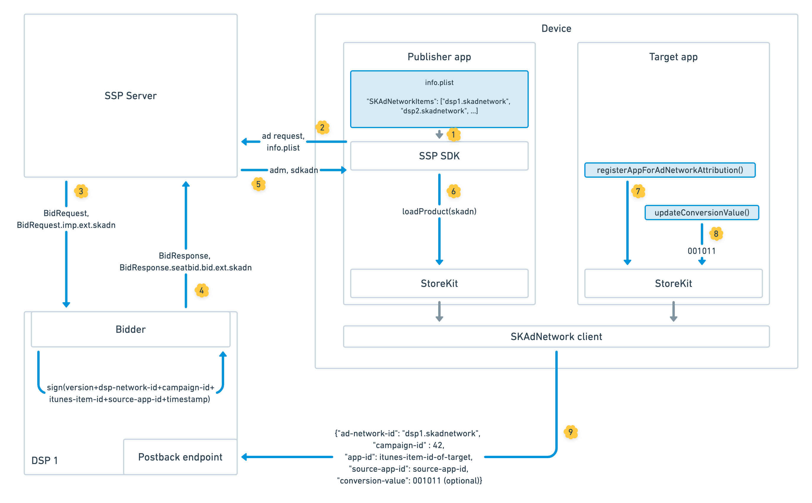

# TODO - SKAdNetwork

## Exelbid의 SKAdNetwork 지원

Exelbid는 iOS 14 변경사항에 따라 기기내 모바일 Install attribution을 위한 프레임워크인 SKAdNetwork를 지원하는 새 버전을 출시하였습니다.

Exelbid는 DSP가 서명된 클릭을 SKAdNetwork API에 전송할 수 있도록 [SKAdNetwork attribution][1]을 지원합니다. Apple에 등록 된 DSP는 다음과 같은 사전 절차가 필요합니다.
1. DSP는 Apple의 SKAdNetwork API에 광고 네트워크로 등록해야합니다.
2. 사인키 설정, 인스톨 콜백 Postback endpoint 등록등의 Postback 연동을 합니다.
3. DSP는 Exelbid에 Apple의 SKAdNetwork ID를 제공합니다.

## SKAdNetwork Support Flow
  

1. Exelbid SDK는 퍼블리셔 App의 info.plist에서 SKADNetworkItems를 가져옵니다.
2. Exelbid SDK는 광고 요청시 SKADNetworkItems를 함께 전송합니다.
3. Exelbid에서는 info.plist에서 SKAdNetwork ID에 적절한 DSP에 `imp.ext.skadn` 객체를 포함하여 입찰 요청합니다.
4. DSP는 입찰되는 캠페인에 필요하다면 `seatbid.bid.ext.skadn` 객체를 포함하여 응답합니다.
5. 해당 DSP의 응답이 낙찰되면 퍼블리셔 App(SDK)에게 skadn object가 포합되어 응답됩니다.
6. 해당 응답이 만약 노출이 되고 클릭이 발생되면 Exelbid SDK는 Dsp의 signature로 서명된 Data를 가지고 StoreKit에 `loadProduct`를 실행합니다.
7. 타켓앱(광고주앱)은 실행시 `registerAppForAdNetworkAttribution()`를 통해 SkAdNetwork에 새로운 사용자를 등록해야 합니다.
8. (Optional).타켓앱(광고주앱)은 6bit의 추가 conversion value 정보를 제공하도록 선택할 수 있습니다. - `updateConversionValue()`
9. SKAdNetwork에서 DSP의 click이 install로 이어진 것을 판단하면, Apple은 퍼블리셔앱(source) app id, 타켓앱(광고주앱) id, 캠페인 id, conversion value등을 포함하여 DSP의 등록된 endpoint로 포스트백을 보냅니다.

## Exelbid에서 SKAdNetwork를 위한 DSP 가이드라인
1. DSP는 Apple의 SKAdNetwork API에 광고 네트워크로 등록해야합니다. https://developer.apple.com/documentation/storekit/
2. DSP는 Exelbid 운영팀에 Apple의 SKAdNetwork ID를 제공합니다. 이때 SKAdNetwork ID는 소문자여야 합니다.
3. Exelbid는 DSP의 SKAdNetwork ID를 Exelbid info.plist에 포함하여 퍼블리셔에 제공합니다.
4. Exelbid는 SKAdNetwork에 적합하다면, DSP에 입찰 요청시 imp.ext.skadn 객체를 포함합니다.
5. DSP는 입찰시 bid.ext.skadn를 포함하여 응답합니다.
6. DSP는 Apple로부터 등록된 Endpoint로 직접 Postback을 받습니다.

## Bid Request - `imp.ext.skadn`
Exelbid는 퍼블리셔의 광고 요청의 info.plist에 DSP의 SKAdNetworkItem가 하나 이상 포함 되어 있다면, Exelbid는 비딩 요청시 아래의 imp.ext.skadn 객체를 포함합니다.
<table>
  <thead>
    <tr>
      <td>
        <strong>Attribute</strong>
      </td>
      <td>
        <strong>Description</strong>
      </td>
      <td>
        <strong>Type</strong>
      </td>
      <td>
        <strong>Example</strong>
      </td>
    </tr>
  </thead>
  <tbody>
    <tr>
      <td>
        <code>version</code>
      </td>
      <td>
        지원되는 SDK 버전. 항상 "2.0"이상이며 지원되는 OS Version과 SDK 버전에 따라 달라질수 있습니다.
      </td>
      <td>
        string
      </td>
      <td>
        "version": "2.0"
      </td>
    </tr>
    <tr>
      <td>
        <code>sourceapp</code>
      </td>
      <td>
        Apple의 App Store에서의 Publisher App ID. 반드시 <code>BidRequest.app.bundle</code>와 동일합니다.
      </td>
      <td>
        string
      </td>
      <td>
        "sourceapp": "880047117"
      </td>
    </tr>
    <tr>
      <td>
        <code>skadnetids</code>
      </td>
      <td>
        DSP와 관련된 퍼블리셔 앱의 info.plist에 있는 SKAdNetworkItem 하위 ids.
      </td>
      <td>
        array of strings
      </td>
      <td>
        "skadnetids": ["cdkw7geqsh.skadnetwork", "qyjfv329m4.skadnetwork"]
      </td>
    </tr>
    <tr>
      <td>
        <code>ext</code>
      </td>
      <td>
        Placeholder for exchange-specific extensions to OpenRTB.
      </td>
      <td>
        object
      </td>
      <td>
        "ext": {}
      </td>
    </tr>
  </tbody>
</table>

#### Example
```
{
  "imp": [
    {
      "ext": {
        "skadn": {
          "version": "2.0",
          "sourceapp": "880047117",
          "skadnetids":[
            "cdkw7geqsh.skadnetwork",
            "qyJfv329m4.skadnetwork"
          ]
        }
      }
    }
  ]
}
```

## Bid Response - `seatbid.bid.ext.skadn`
입찰 요청에 imp.ext.skadn 객체가 포함 된 경우 DSP는 입찰 응답에 다음의 seatbid.bid.ext.skadn를 추가할 수 있습니다.
Exelbid에서는 seatbid.bid.ext.skadn가 응답되는 경우 click시 절차에 따라 Storekit에  loadProduct()를 호출합니다.

#### Object: `BidResponse.seatbid.bid.ext.skadn`

<table>
  <thead>
    <tr>
      <td>
        <strong>Attribute</strong>
      </td>
      <td>
        <strong>Description</strong>
      </td>
      <td>
        <strong>Type</strong>
      </td>
      <td>
        <strong>Example</strong>
      </td>
    </tr>
  </thead>
  <tbody>
    <tr>
      <td>
        <code>version</code>
      </td>
      <td>
        요청 SKAdNetwork 버전에 대응되는 응답 SKAdNetwork 버전.
      </td>
      <td>
        string
      </td>
      <td>
        "version": "2.0"
      </td>
    </tr>
    <tr>
      <td>
        <code>network</code>
      </td>
      <td>
        요청의 skadnetids중 하나와 일치해야 하는 서명에 사용되는 Ad network id
      </td>
      <td>
        string
      </td>
      <td>
        "network": "cdkw7geqsh.skadnetwork"
      </td>
    </tr>
    <tr>
      <td>
        <code>campaign</code>
      </td>
      <td>
        Apple Spec과 호환되는 캠페인 ID입니다. 2.0부터는 문자열로 표현되는 1에서 100 사이의 정수 여야합니다.
      </td>
      <td>
        string
      </td>
      <td>
        "campaign": "45"
      </td>
    </tr>
    <tr>
      <td>
        <code>itunesitem</code>
      </td>
      <td>
        타겟/광고앱의 Apple AppStore id입니다. 반드시<code>BidResponse.seatbid.bid.bundle</code>와 일치해야 합니다.
      </td>
      <td>
        string
      </td>
      <td>
        "itunesitem": "123456789"
      </td>
    </tr>
    <tr>
      <td>
        <code>nonce</code>
      </td>
      <td>
        해당 응답의 고유한 ID
      </td>
      <td>
        string
      </td>
      <td>
        "nonce": "473b1a16-b4ef-43ad-9591-fcf3aefa82a7"
      </td>
    </tr>
    <tr>
      <td>
        <code>sourceapp</code>
      </td>
      <td>
        퍼블리셔앱의 Apple AppStre id. 반드시<code>BidRequest.imp.ext.skad.sourceapp</code>와 일치해야 합니다.
      </td>
      <td>
        string
      </td>
      <td>
        "sourceapp": "880047117"
      </td>
    </tr>
    <tr>
      <td>
        <code>timestamp</code>
      </td>
      <td>
        SKAdnetwork signature timestamp String
      </td>
      <td>
        string
      </td>
      <td>
        "timestamp": "1594406341232"
      </td>
    </tr>
    <tr>
      <td>
        <code>signature</code>
      </td>
      <td>
        Apple에서 정의된 SKAdnetwork signature
      </td>
      <td>
        string
      </td>
      <td>
        "signature": "MEQCIEQlmZRNfYzK…"
      </td>
    </tr>
    <tr>
      <td>
        <code>ext</code>
      </td>
      <td>
        Placeholder for exchange-specific extensions to OpenRTB.
      </td>
      <td>
        object
      </td>
      <td>
        "ext": {}
      </td>
    </tr>
  </tbody>
</table>

#### Example v2.0

```
{
  "seatbid": [
    {
      "bid": [
        {
          "ext": {
            "skadn": {
              "version": "2.0",
              "network": "cdkw7geqsh.skadnetwork",
              "campaign": "45",
              "itunesitem": "123456789",
              "nonce": "473b1a16-b4ef-43ad-9591-fcf3aefa82a7",
              "sourceapp": "880047117",
              "timestamp": "1594406341232",
              "signature": "MEQCIEQlmZRNfYzKBSE8QnhLTIHZZZWCFgZpRqRxHss65KoFAiAJgJKjdrWdkLUOCCjuEx2RmFS7daRzSVZRVZ8RyMyUXg=="
            }
          }
        }
      ]
    }
  ]
}
```


[1]: https://developer.apple.com/documentation/storekit/skadnetwork
[2]: https://developer.apple.com/documentation/storekit/skadnetwork/configuring_the_participating_apps
[3]: https://d2al1opqne3nsh.cloudfront.net/images/skadnetwork-flow@2x.png
[4]: https://developer.apple.com/documentation/storekit/skadnetwork/generating_the_signature_to_validate_an_installation
[5]: https://developer.apple.com/documentation/uikit/uidevice/1620059-identifierforvendor
[6]: https://developer.apple.com/documentation/apptrackingtransparency/attrackingmanager/authorizationstatus
[7]:  https://developer.apple.com/documentation/storekit/skstoreproductviewcontroller/1620632-loadproduct
[8]: https://github.com/InteractiveAdvertisingBureau/GDPR-Transparency-and-Consent-Framework/
[9]: #skadnetwork-id-lists-for-app-developers
[10]: #skadnetwork-extension
[11]: #device-extension
[12]: #skadnetwork-id-lists-for-app-developers
[13]: #proposals-for-large-skadnetwork-id-list-management
[14]: https://developer.apple.com/documentation/storekit/skadnetwork/generating_the_signature_to_validate_view-through_ads
[15]: #IABTL-managed-SKAdnetwork-ID-list
[16]: https://github.com/InteractiveAdvertisingBureau/openrtb/blob/master/OpenRTB%20v3.0%20FINAL.md#list--loss-reason-codes-
